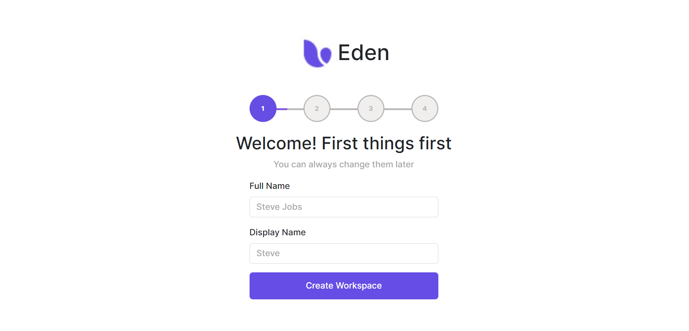
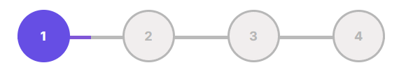
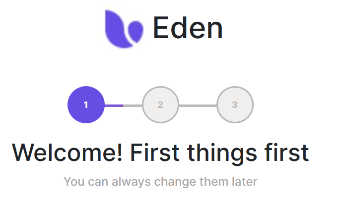
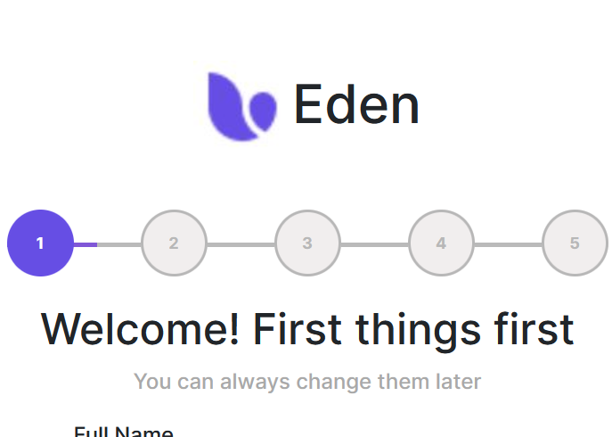
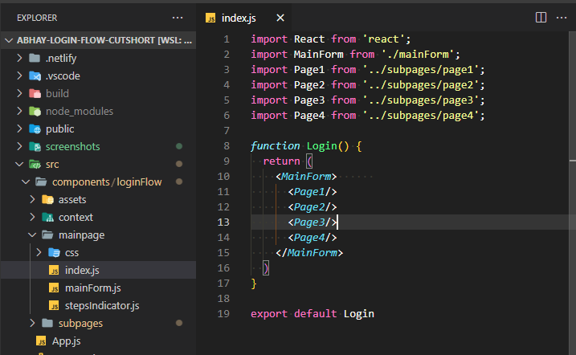
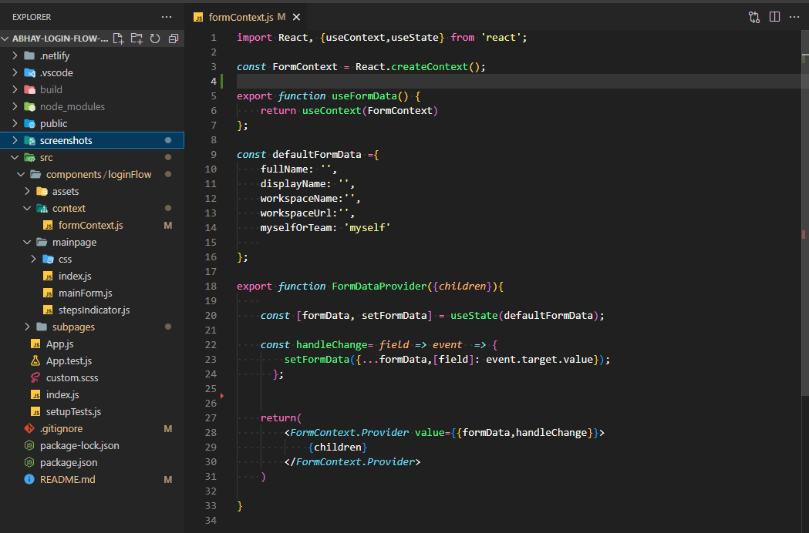
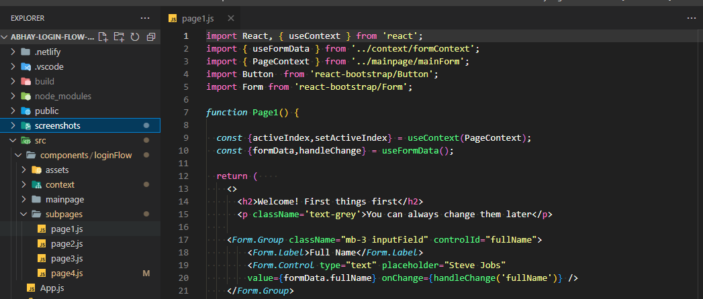
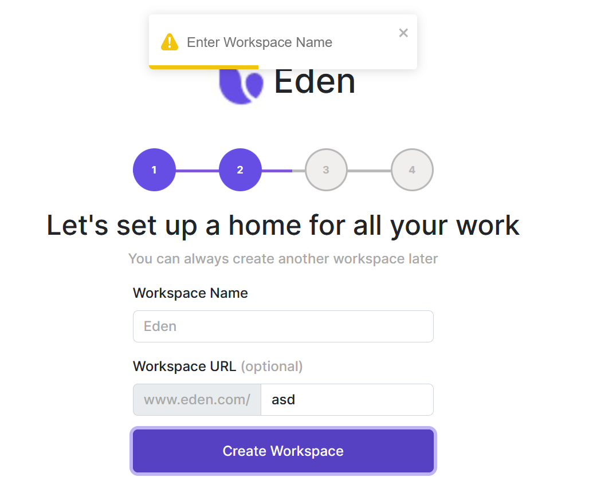

# Login flow with multiple steps -Abhay

## Deployed on netlify [here](https://abhays-scalable-login-flow.netlify.app/)

Project built with `React, Bootstrap.css & vanilla Css`

#

## Main Features

### `1. Progress indicators`

1. Indicators auto-populate as per the number of pages
2. Changes color to show progress
3. Go to previous step with click 
4. Only completed steps are clickable to go back in steps
5. Clickable objects show link pointer on hover

**Made using only `HTML & CSS`**

 

** Few screenshots:**

Progress indicator when `Mainform` is passed 3 subpages

Progress indicator when `Mainform` is passed 5 subpages

#

### `2. Simpler page management`

1. Form states managed by `../formContext.js`
2. Avoids prop drilling
3. `Mainform` component generates elements as per children
4. Easy to disable pages by commenting out in `Login` component

**Made using  `React context`**

 

**Reference screenshots:**

`FormContext` exposes custom hook `useFormData` to access & set the Form states across pages:

 

Sample page component that uses hook `useFormData` to control components, and  `PageContext` for page states

(To generate such subpages, replicate this and add to `defaultFormData` in `formContext.js`)

#

### `3. Snackbar notification (bonus feature)`

 

1. Can be used for disappearing notifications
2. Messages on input validation, success, warnings

**Made using `React Toastify`**

#
Inspired from [Eren's dribbble](https://dribbble.com/shots/15669113-Onboarding-Exploration/attachments/7464145?mode=media)

